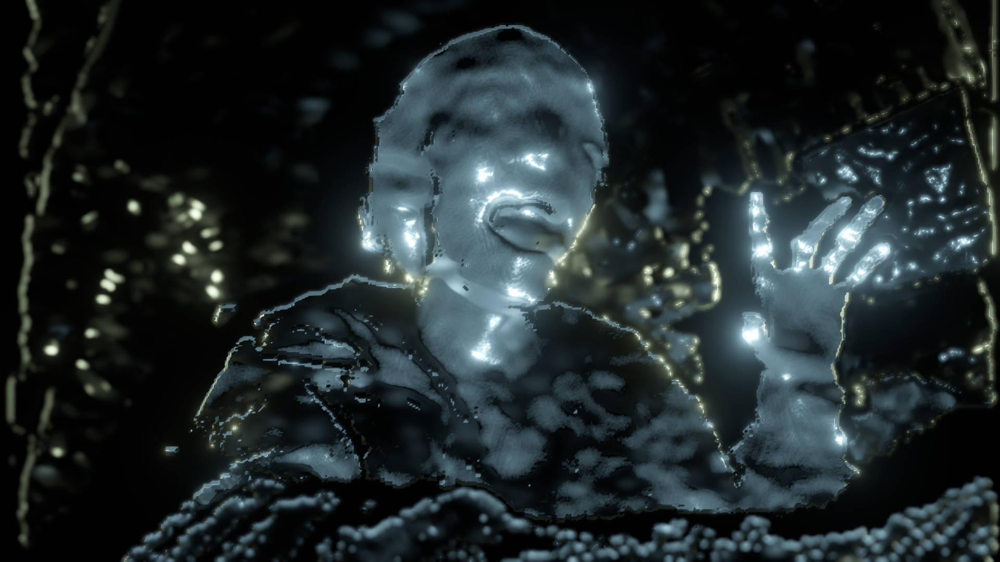

# Visualize RealSense Depth Camera Depth Data

## Using

- [Unity](https://unity3d.com/)
- [Intel RealSense Unity wrapper](https://github.com/IntelRealSense/librealsense/tree/master/wrappers/unity)

## Screen Shot

- Assets/Visualize/Scenes/voxel.unity
- https://youtu.be/r6qXq082iH4

---

- Assets/Visualize/Scenes/mesh.unity